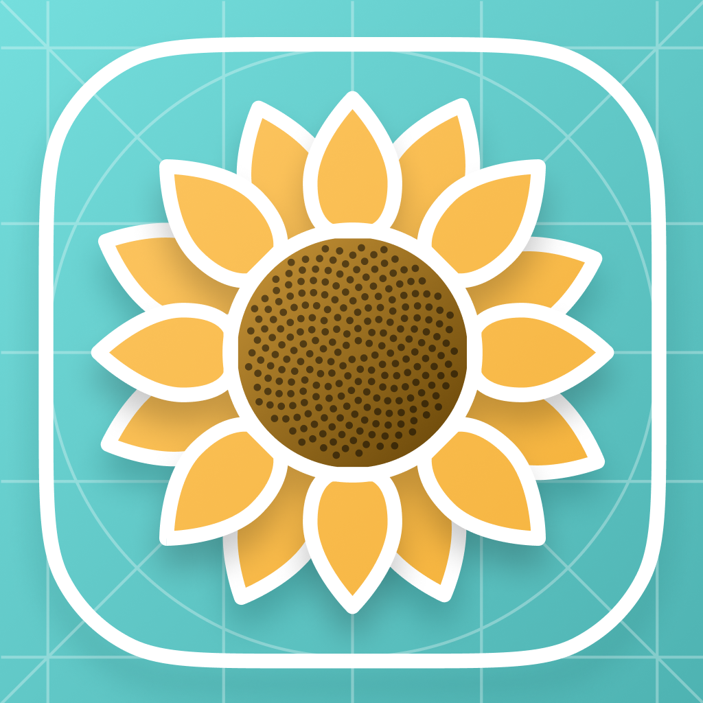

# Sunflower - iOS


   



## Description

Welcome to the public Sunflower SDK. Sunflower is the IDnow Design System, a library of components higly customizable to match with client preferences. This SDK is directly used in many of our products.

## Setup

Sunflower is available via Swift Package Manager only. We do not support pods integration.

> ⚠️ Lottie is required to run Sunflower, it will be automatically imported.

### Swift Package Manager

For external usage
```
Source : https://github.com/idnow/sunflower-sdk-ios

Exact version : <version_you_want>
```

## Customization

SunflowerUIKit have default values corresponding to the internal IDnow theme. 
If you want to use your own theme, you must add this import to your file.

```swift
import SunflowerUIKit
```

Then you can create a theme with desired colors, radius and spacing.

```swift

// Choose your colors
let brandColors = BrandColors(
    primary: UIColor.orange,
    primaryVariant: UIColor.orange,
    secondary: UIColor.orange,
    secondaryVariant: UIColor.orange,
    error: UIColor.orange,
    processing: UIColor.orange,
    success: UIColor.orange,
    active: UIColor.orange
)
let greyColors = GreyColors(
    grey100: UIColor.gray,
    grey200: UIColor.gray,
    grey300: UIColor.gray,
    grey400: UIColor.gray,
    grey500: UIColor.gray,
    grey600: UIColor.gray,
    grey800: UIColor.gray,
    grey900: UIColor.gray
)
let customColors = IDnowColors(brand: brandColors, grey: greyColors)

// Define your radius
let customRadius = IDnowRadius(
    radius1: 8,
    radius2: 16,
    radius3: 24,
    radius4: 400
)

// Set your spacings
let customSpacing = IDnowSpacing(
    spacing0_5: 8,
    spacing1: 16,
    spacing2: 24,
    spacing3: 32,
    spacing4: 40,
    spacing5: 48,
    spacing6: 56
)
let primitives = IDnowPrimitives(
    colors: customColors, 
    radius: customRadius, 
    spacing: customSpacing
)
```

Then, you need to apply your custom theme like this
```
IDnowDesignSystem.shared.setup(primitives: primitives, isLightMode: true)
```
It needs to be done only one time, no need to do it each time you want to use a component.

## Components

Sunflower is composed of several components like custom text, button, textfields or views. It is only available for UIKit integration. 

### How to integrate
To integrate the Sunflower library, simply import the SDK like that.
```swift
import SunflowerUIKit
```
If you want to use the available components, you can find the documentation of each of our components inside the /docs folders. It describes the component and how to integrate it.

### Tokens

In order for the application using the design system to be consistent, it is recommended to use tokens.

- IDnowColorsToken
- IDnowRadiusToken
- IDnowSpacingToken