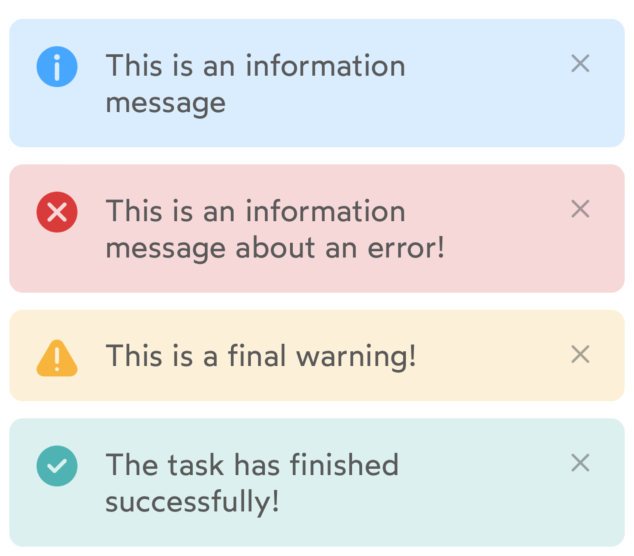
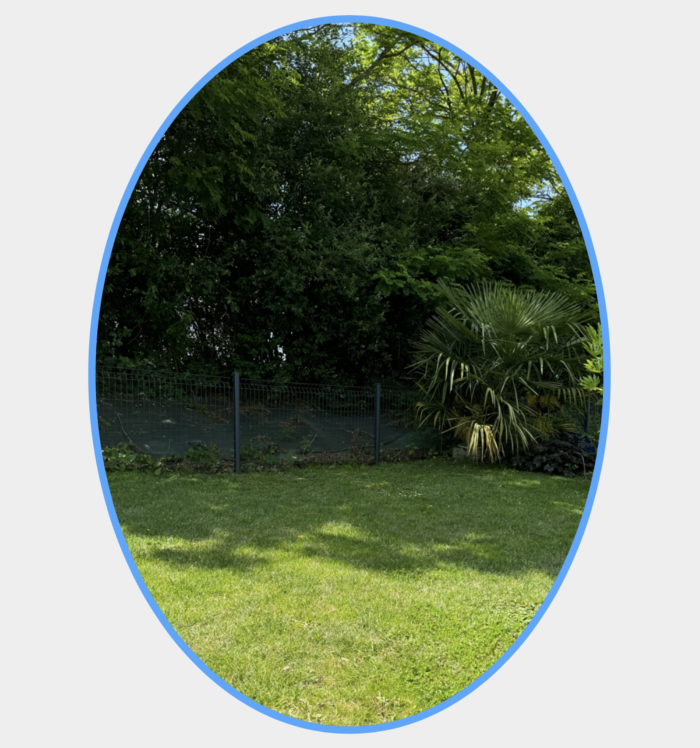
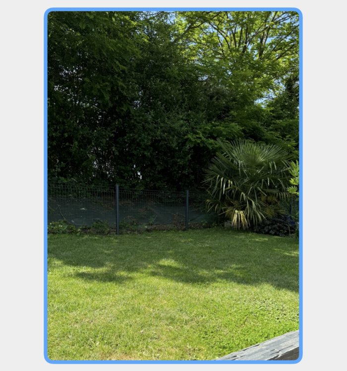
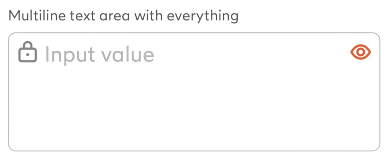
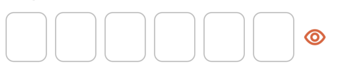
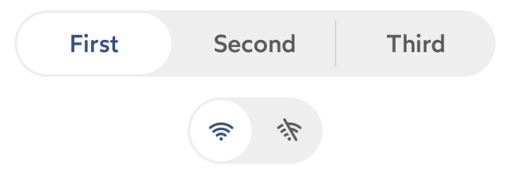

# Sunflower - iOS


 
  

{width=25%}

[[_TOC_]]

## Description

The Design System is composed of a library of components and a Storybook to showcase these components.

It is based on the IDnow Figma design v3:

- [Design system V3](https://www.figma.com/file/sdbEJdxAmkc5bevNwNcubq/Design-System-v.3)
- [Design System Tokens](https://www.figma.com/file/lnQKNDEzRIlkrKN29F2AzA/DS-Tokens)
- [Storybook](https://design-system-idnow.netlify.app) : The authentication is secured by the French keycloak (demo platform). <br>User: anonymous@idnow.de, credentials are shared on passbolt.

## Import

To use the design system in your application, you need to add it from SwiftPackageManager or Cocoapods.

> ⚠️ Lottie is required to run Sunflower, so you need to import it either via SPM or Cocoapods.

### Cocoapods

Source for internal usage
```
source 'git@gitlab.rennes.ariadnext.com:mobile/podspecs-private-repo.git'

pod 'SunflowerUIKit', '<version_you_want>'
pod 'lottie-ios', '4.5.1'
```

For external usage 
```
source 'https://git-externe.rennes.ariadnext.com/idcheckio/axt-podspecs.git'

pod 'SunflowerUIKit', '<version_you_want>'
pod 'lottie-ios', '4.5.1'
```

### Swift Package Manager

For internal usage
```
Source : https://gitlab.rennes.ariadnext.com/mobile/idnow-design-system/sunflower-releases.git
Lottie source : https://github.com/airbnb/lottie-spm.git

Exact version : <version_you_want>
```
For external usage
```
Source : https://git-externe.rennes.ariadnext.com/idcheckio/sunflower.git
Lottie source : https://github.com/airbnb/lottie-spm.git

Exact version : <version_you_want>
```

## Customize

If you want to use your own theme, you must add this import to your file.

```swift
import SunflowerUIKit
```

Then you can create a theme with desired colors, radius and spacing.

```swift

// Choose your colors
let brandColors = BrandColors(
    primary: UIColor.orange,
    primaryVariant: UIColor.orange,
    secondary: UIColor.orange,
    secondaryVariant: UIColor.orange,
    error: UIColor.orange,
    processing: UIColor.orange,
    success: UIColor.orange,
    active: UIColor.orange
)
let greyColors = GreyColors(
    grey100: UIColor.gray,
    grey200: UIColor.gray,
    grey300: UIColor.gray,
    grey400: UIColor.gray,
    grey500: UIColor.gray,
    grey600: UIColor.gray,
    grey800: UIColor.gray,
    grey900: UIColor.gray
)
let customColors = IDnowColors(brand: brandColors, grey: greyColors)

// Define your radius
let customRadius = IDnowRadius(
    radius1: 8,
    radius2: 16,
    radius3: 24,
    radius4: 400
)

// Set your spacings
let customSpacing = IDnowSpacing(
    spacing0_5: 8,
    spacing1: 16,
    spacing2: 24,
    spacing3: 32,
    spacing4: 40,
    spacing5: 48,
    spacing6: 56
)
let primitives = IDnowPrimitives(
    colors: customColors, 
    radius: customRadius, 
    spacing: customSpacing
)
IDnowDesignSystem.shared.setup(primitives: primitives, isLightMode: true)
```

## Components

Depending on whether you're using UIKit, you'll need to import the appropriate package.

```swift
import SunflowerUIKit
```


| Component | Example | Documentation link |
| ---       | ---     | ---                |
| IDnowAutocompleteTextFieldView | {width=200} | [link](./docs/IDnowAutocompleteTextFieldView.md) |
| IDnowButtonView | {width=150}<br />{width=150} | [link](./docs/IDnowButtonView.md) |
| IDnowCheckbox | {width=150} | [link](./docs/IDnowCheckbox.md) |
| IDnowDatePicker | {width=200}<br> | [link](./docs/IDnowDatePicker.md) |
| IDnowEntryButton | {width=200}<br /> {width=200} | [link](./docs/IDnowEntryButton.md) |
| IDnowFloatingButtonView | {width=150} | [link](./docs/IDnowFloatingButtonView.md) |
| IDnowImageView | - | [link](./docs/IDnowImageView.md) |
| IDnowInfoView | {width=200} | [link](./docs/IDnowInfoView.md) |
| IDnowLabel | - | [link](./docs/IDnowLabel.md) |
| IDnowLottie | - | [link](./docs/IDnowLottie.md) |
| IDnowMaskView | {width=200}<br /><br />{width=200}<br /> | [link](./docs/IDnowMaskView.md) |
| IDnowMessageView | {width=200} | [link](./docs/IDnowMessageView.md) |
| IDnowModal | {width=200}<br />{width=200}<br />{width=200} | [link](./docs/IDnowModal.md) |
| IDnowMultilineTextInput | {width=200} | [link](./docs/IDnowMultilineTextInput.md) |
| IDnowPhoneNumberTextFieldView | {width=200} | [link](./docs/IDnowPhoneNumberTextFieldView.md) |
| IDnowPinView | {width=200} | [link](./docs/IDnowPinView.md) |
| IDnowRadio | {width=150} | [link](./docs/IDnowRadio.md) |
| IDnowSegmentedControlView | {width=200}<br /> | [link](./docs/IDnowSegmentedControl.md) |
| IDnowSelectFieldView | {width=200} | [link](./docs/IDnowSelectFieldView.md) |
| IDnowSpeechBubbleView | {width=200} | [link](./docs/IDnowSpeechBubbleView.md) |
| IDnowSwitchControl | {width=300}<br /> | [link](./docs/IDnowSwitchControl.md) |
| IDnowTagLabel | {width=200} | [link](./docs/IDnowTagLabel.md) |
| IDnowTextFieldView | {width=300} | [link](./docs/IDnowTextFieldView.md) |
| IDnowTextView | - | [link](./docs/IDnowTextView.md) |
| IDnowTutorialStep | {width=200}<br /> {width=200} | [link](./docs/IDnowTutorialStep.md) |
| IDnowViewController | {width=200} | [link](./docs/IDnowViewController.md) |

### Tokens

In order for the application using the design system to be consistent, it is recommended to use tokens.

- IDnowColorsToken
- IDnowRadiusToken
- IDnowSpacingToken

## Development

### Project overview

This project is composed of differents modules:

- **Sunflower**
  - **SunflowerCommon**: primitives and tokens for colors, radius and spacing, font and textStyles
  - **SunflowerUIKit**: components library using UIKit
- **SunflowerShowcase**: showcase for the components (using UIKit).

### Setup

1. Install SwiftLint

To be able to build the project you need to install Swiftlint on your Mac with Homebrew (specific path in Build Phases).

```
brew install SwiftLint
```

2. Install SwiftGen
To be able to build the project you need to install SwiftGen on your Mac with Homebrew (specific path in Build Phases).

```
brew install swiftgen
```

### Coding rules

In order to have well-organized files, we recommend using the following MARKs in the files:

```swift
// MARK: - IBOutlets

// MARK: - Public properties

// MARK: - Privates properties

// MARK: - Internal properties

// MARK: - Initializers

// MARK: - Public methods

// MARK: - Private methods

// MARK: - Internal methods

// MARK: Actions

// MARK: - Extension <Name of the class or the protocol extended>
```

It is also important to add documentation comments (use `///`) above classes, public properties and public functions.

### How to Release ?

Step to release a Sunflower version :

- With git flow create a new version (this will create a branch from develop named release/<my version>)
- Search the previous version in all the project and update fields (after that build the project to be sure everything is updated). Don't forget to update the README.
- Commit your changes
- With git flow close the version with a tag name (this will merge on develop and master and create the tag on master)
- Now fingers crossed that the pipeline is successful (build job is automatic but testflight and UIKit are manuals)
- Good job, the new version is released ! 🎉
