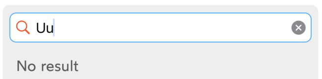
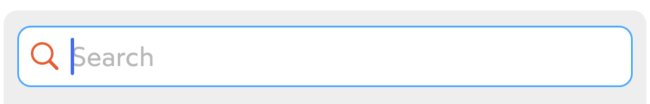
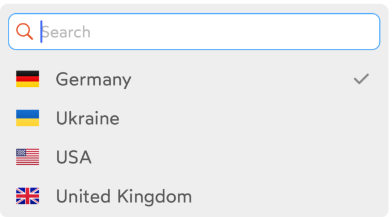

# IDnowAutocompleteTextFieldView
`IDnowAutocompleteTextFieldView` is based on `IDnowDropdownTextFieldView` and designed to handle the user input and a dropdown view with suggestions. <br/>

## Usage
### Configuration
```
myDropdown.configure(IDnowDropdownTextFieldConfiguration(
    placeholderText: "---",
    topText: "Select item",
    bottomText: "This data is required",
    errorText: "This field must not be empty",
    leftIcon: IDnowIcon.calendar.image,
    rightIcon: IDnowIcon.identityDocument.image,
    clearButtonVisible: false,
    disabled: false,
    processing: false,
    dropdownItems: [IDnowDropdownItem(title: "Item 1", value: "Item 1"),
                    IDnowDropdownItem(title: "Item 2", value: "Item 2"),
                    IDnowDropdownItem(title: "Item 3", value: "Item 3"),
                    IDnowDropdownItem(title: "Item 4", value: "Item 4")],
    selectedItem: IDnowDropdownItem(title: "Item 2", value: "Item 2"),
    parentViewController: self)
)
```
### Methods
Select item from code.
```
myDropdown.selectItem(IDnowDropdownItem(title: "Item 1", value: "Item 1"))
```

## Functions

### Configuration

Dropdown fields are configured by the ```IDnowDropdownTextFieldConfiguration```. Additionally to the standard fields in the [IDnowTextField](./IDnowTextField.md) the configuration has the following fields to configure the dropdown appearance:

| Variable name | Type | Visual rendering | Description |
| --- | --- | --- | --- |
| emptyStateMessage | String? | {width=200} | Optional text to be displayed in the phone input field if there are no matches found for the search query. Should be localized. |
| searchHint | String? | {width=200} | Optional text to be displayed as a placeholder for the search field of a dropdown list. Should be localized. |
| dropdownItems | [IDnowDropdownItem] | {width=200} <br /> | The items for the dropdown list. The data item consists of the following fields:<br />```title: String```<br />```value: String?```<br />```image: UIImage?```<br />```selectable: Bool``` |
| selectedItem | IDnowDropdownItem? | {width=200} | Optional item that was previously selected. If assigned, the selected item will have a checkmark on the right of the item. |
| parentViewController | UIViewcontroller? | - | Needed only to handle the presentation of the phone input and multiselect dropdowns. |

