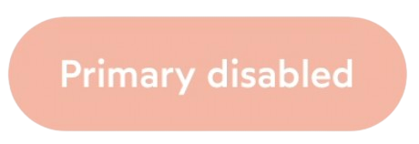
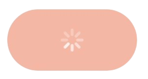

# IDnowButtonView

Add a UIView type object to your storyboard and apply the `IDnowButtonView` class to it.

## Usage
### Configuration
```
myButtonView.configure(IDnowButtonConfiguration(
    style: IDnowButtonStyle.primary,
    title: "My title",
    isButtonEnabled: true,
    isLoading: false,
    leftIcon: nil,
    rightIcon: nil,
    hasExternalBorder: false
))
```
### Methods
Set button listener
```
myButtonView.touchUpInside = { [weak self] in
    // My Action
}
```

Set button is loading or not
```
myButtonView.setLoading(true)
```

## Properties

| Variable name | Type | Visual rendering | Description |
| --- | --- | --- | --- |
| style | IDnowButtonStyle?  | {width=150}<br> {width=150} | Possible values (*IDnowButtonStyle*) : <br> - **primary** *(default value)* <br>- **secondary** <br><br> This variable is used to apply a style to the button. |
| title | String?  | - | Button title. |
| isButtonEnabled | Bool | {width=200}<br>{width=200} | Possible values :<br> - **true** *(default value)* <br>- **false** <br><br> Makes the button active or not. |
| isLoading | Bool | {width=150} | Possible values :<br> - **true** *(default value)* <br>- **false** <br><br>Puts the button in loading state |
| leftIcon | UIImage? | {width=200}<br> {width=200} | Add an icon to the left of the text. |
| rightIcon | UIImage? | {width=200}<br> {width=200} | Add an icon to the right of the text. |
| hasExternalBorder | Bool? | {width=200}| Possible values :<br> - **true** <br>- **false** *(default value)* <br><br>Add external border arround the button. |
| **Margins** | - | - | - |
| marginTop<br> marginBottom <br> marginLeft <br> marginRight | String | - | Possible values (*IDnowSpacingToken*) : <br> - **noSpacing** *(default value)* <br>- **secondary** <br>- **spacingXs** <br>- **spacingSm** <br>- **spacingMd** <br>- **spacingLg** <br>- **spacingXl** <br>- **spacing2xl** <br>- **spacing3xl** <br><br> In order to add margins around the component, you can use IDnowSpacingToken to keep your application consistent (set all constraints to 0 in the storyboard). |

## Functions

### Configuration

To configure the button, it is possible either to set the variables in the code one by one, to use the storyboard or to use the [configuration protocol](./View%20Configuration.md).


| Name | Type | Description |
| --- | --- | --- |
| style | String? | String representation of ```IDnowButtonStyle``` |
| title | String? | Optional title for the button |
| isButtonEnabled | Bool | Toggles the button interaction state |
| isLoading | Bool | Toggles the loading state of the button |
| leftIcon | UIImage? | Optional icon to display before the button text |
| rightIcon | UIImage? | Optional icon to display after the button text  |
| hasExternalBorder | Bool? | Optional border to display arround the button |

### Loading

To put the button in a loading state it is possible to set the isLoading variable or use the **setLoading** function.

