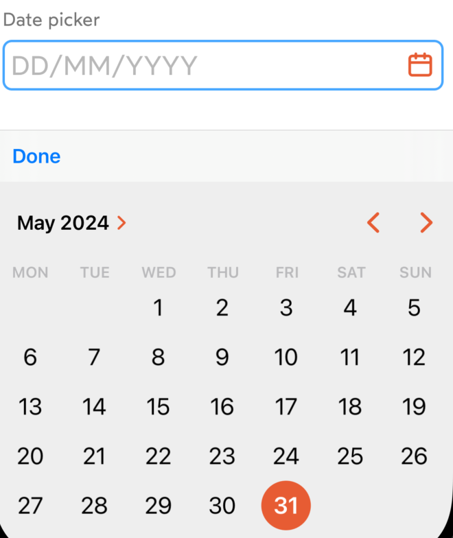

# IDnowDatePicker

`IDnowDatePicker` is a subclass of the [IDnowTextFieldView](./IDnowTextFieldView.md) therefore it has the identical appearance and configuration but uses the system DatePicker component instead of the keyboard.

Currently, the date fromat is: ```dd/MM/yyyy```

## Usage
### Configuration
```
myDatePicker.configure(IDnowTextFieldConfiguration(
    placeholderText: "01/01/1970",
    topText: "Date",
    bottomText: "This date is required",
    errorText: "This field must not be empty",
    leftIcon: IDnowIcon.calendar.image,
    rightIcon: IDnowIcon.identityDocument.image,
    clearButtonVisible: false,
    disabled: false,
    processing: false
))
```
```
myDatePicker.dateFormat = DateFormatter.dateFormat(
    fromTemplate: "dd/MM/yyyy", 
    options: 0, 
    locale: Locale.current
)
```
### Methods
Retrieve selected date
```
let selectedDate = myDatePicker.getDate()
```

## Properties

See [IDnowTextFieldView](./IDnowTextFieldView.md)

## Functions

### Configuration

See [IDnowTextFieldView](./IDnowTextFieldView.md)

### Usage

Can be instantiated directly from the code. The element has a dynamic height, so it's recommended to embedd it into a StackView.

The date can be retrieved by calling ```func getDate() -> Date?```

### Appearance

{width=150}
