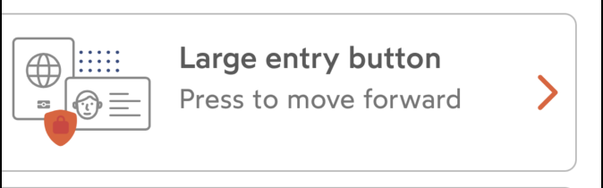
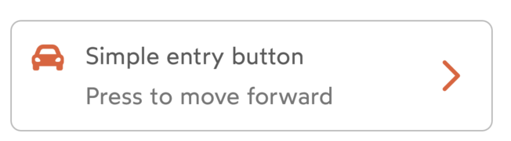
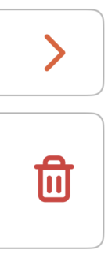
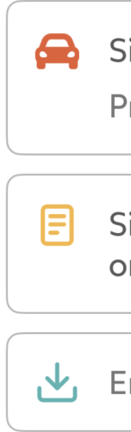

# IDnowEntryButton

`IDnowEntryButton` is a component designed to be used for creating entry buttons with optional Lottie animation, an icon, and two text labels for the title and description.

## Usage
### Configuration
```
myEntryButton.configure(IDnowEntryButtonConfiguration(
    titleText: "Title",
    descriptionText: "Description",
    style: EntryButtonStyle.medium,
    rightButtonIcon: IDnowIcon.chevronRight,
    rightButtonTintColor: IDnowImageTintColor.primaryBackground,
    leftIcon: IDnowIcon.chevronLeft,
    leftIconTintColor: IDnowImageTintColor.primaryBackground,
    lottieConfig: IDnowLottieConfiguration(
        lottieName: "myLottie", 
        lottieBundle: Bundle.main),
    tapAction: {
        // Action on tap on entryButton
    },
    rightButtonAction: {
        // Action on right button tap
    }
))
```
### Methods
```
myEntryButton.playAnimation {
    // Action after playing animation
}
```
```
myEntryButton.stopAnimation()
```

## Functions
### Fields/Configuration

Entry button is configured by the `IDnowEntryButtonConfiguration`. The same fields can be set separately on the component instance.

| Variable name | Type | Visual rendering | Description |
| --- | --- | --- | --- |
| style | EntryButtonStyle | {width=300}<br />{width=300} | Button style to use. Possible values:<br />**-large**<br />**-medium** (*default*)   |
| lottieConfig | IDnowLottieConfiguration | - | Configuration for the inner `IDnowLottie` used to set the required animation. |
| rightButtonIcon | IDnowIcon | - | Icon to be displayed on the right button. Mandatory, default is chevronRight |
| rightButtonTintColor | IDnowImageTintColor? | {width=100} | Right button tint color. Mandatory, default is primary background | 
| leftIcon | IDnowIcon? | {width=100} | Icon to be displayed on the left of the button. Optionnal, nil to hide it. |
| leftIconTintColor | IDnowImageTintColor? | {width=100}| Left icon tint color. Optionnal. |
| titleText | String? | - | Text to be displayed as the title of the entry button. |
| descriptionText | String? | - | Texto to be displayed as the description of the entry button. |
| tapAction | (() -> Void)? | - | Callback main action to be executed when the entry button is tapped. |
| rightButtonAction | (() -> Void)? | - | Callback on the right button when touched up inside. |

### Methods

`IDnowEntryButton` has two public methods to control the Lottie animation playback. They are:

```
func playAnimation(completion: ((_ completed: Bool) -> Void)? = nil)
func stopAnimation()
```