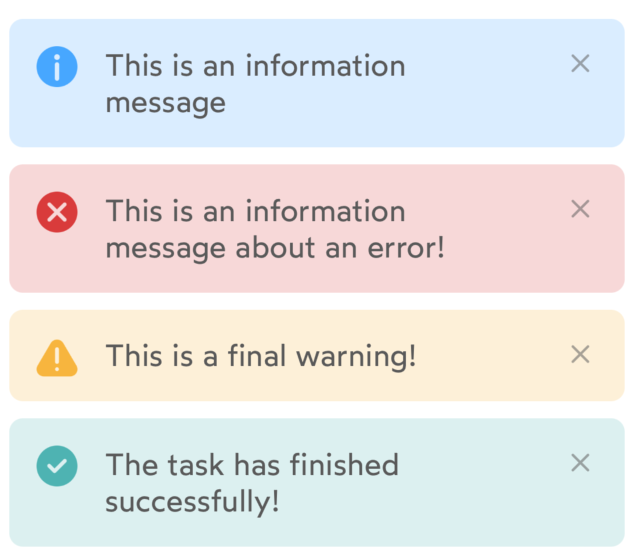
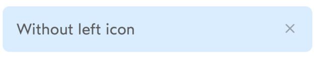
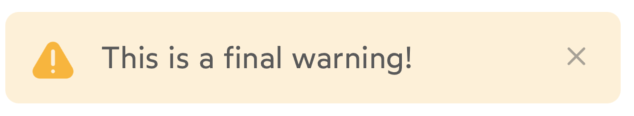
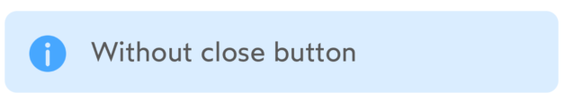

# IDnowInfoView

`IDnowInfoView` is a generic information view that can be used either as a part of the layout or displayed as a pop-up.

## Usage
Can be used from both Storyboard and code. Should be placed into a stackview if used directly in the layout with the close button. This allows the info view to be dismissed with an animation.

In order to use as a popup, no need to instantiate it, just call ```func presentInfoView(withMessage message: String, type: IDnowInfoType, dismissAfter duration: TimeInterval? = 3.0)``` on a UIViewController instance.

### Configuration
```
myInfoView.configure(IDnowInfoViewConfiguration(
    type: IDnowInfoType.info,
    text: "My info",
    leftIcon: IDnowIcon.information.image,
    leftIconHidden: false,
    closeButtonHidden: false
))
```
### Methods
```
myInfoView.onClosePressed = { info in
    // Action on close pressed
}
```
Display or hide infoView with animation
```
myInfoView.setHidden(true)
```
## Properties

See configuration table.

## Functions
### Configuration

| Variable name | Type | Visual rendering | Description |
| --- | --- | --- | --- |
| type | IDnowInfoType | {width=300} | Sets the appearance and the appropriate standard icon (if custom icon is not provided). Possible values:<br>**- info** (*default*) <br>**- error** <br>**- warning** <br>**- success** |
| text | String? | {width=300} | Sets the message of the info view. |
| leftIcon | UIImage | {width=300} | An icon that will override the default one. |
| leftIconHidden | Bool | {width=300}<br>{width=300} | Toggles the visibility of the icon on the left.<br>Default value: *false* |
| closeButtonHidden | Bool | {width=300} | Toggles the visibility of the close button on the right.<br>Default value: *false* |

