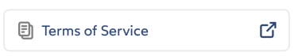
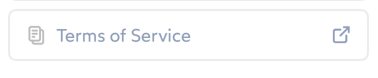
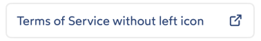
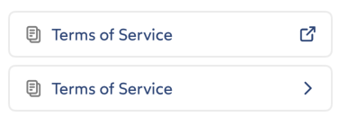

# IDnowLinkButtonView

`IDnowLinkButtonView` is a custom view component that inherits from `IDnowView`. It provides a link-style button with optional left and right icons, and configurable appearance following the IDnow design system.

## Usage

### Configuration

```swift
let linkButtonView = IDnowLinkButtonView()
linkButtonView.configure(IDnowLinkButtonViewConfiguration(
    title: "Open Document",
    isButtonEnabled: true,
    leftIcon: IDnowIcon.documents,
    rightIcon: IDnowIcon.externalLink
))

linkButtonView.touchUpInside = {
    // Action on link button tap
}
linkButtonView.setMargins(top: .spacingXs, bottom: .spacingXs, left: .spacingMd, right: .spacingMd)
linkButtonView.widthAnchor.constraint(equalTo: supperView.widthAnchor, multiplier: 1.0).isActive = true
```

### Direct Property Setting

```swift
linkButtonView.title = "View Details"
linkButtonView.leftIcon = IDnowIcon.info
linkButtonView.rightIcon = IDnowIcon.chevronRight
linkButtonView.isButtonEnabled = true
```

## Functions

### Fields/Configuration

Link button view is configured by the `IDnowLinkButtonViewConfiguration`. The same fields can be set separately on the component instance.

| Variable name | Type | Visual rendering                                                       | Description                                                                                                    |
| --- | --- |------------------------------------------------------------------------|----------------------------------------------------------------------------------------------------------------|
| title | String?       |                       | The button's text label, aligned to the left. Optional nil .                                                   |
| isButtonEnabled | Bool |       | Whether the button is enabled and can be tapped. Default is `true`. When disabled, content opacity is reduced. |
| leftIcon | IDnowIcon?   |        | Icon displayed on the left side of the button. Default is `IDnowIcon.documents`.                               |
| rightIcon | IDnowIcon?  |  | Icon displayed on the right side of the button. Default is `IDnowIcon.externalLink`.                           |
| touchUpInside | (() -> Void)? | -                                                                      | Callback action to be executed when the button is tapped.                                                      |

### Methods

`IDnowLinkButtonView` inherits standard UIView methods and provides automatic styling and accessibility support. The component handles touch animations and state changes internally.


## Examples

### Document Link Button

```swift
let documentButton = IDnowLinkButtonView()
documentButton.configure(IDnowLinkButtonViewConfiguration(
    title: "View Document",
    leftIcon: IDnowIcon.documents,
    rightIcon: IDnowIcon.externalLink
))
documentButton.touchUpInside = {
    // Open document viewer
}
```

### Navigation Link Button

```swift
let navButton = IDnowLinkButtonView()
navButton.title = "Go to Settings"
navButton.leftIcon = IDnowIcon.settings
navButton.rightIcon = IDnowIcon.chevronRight
navButton.touchUpInside = {
    // Navigate to settings
}
```

### Disabled State
```swift
let disabledButton = IDnowLinkButtonView()
disabledButton.configure(IDnowLinkButtonViewConfiguration(
    title: "Processing...",
    isButtonEnabled: false,
    leftIcon: IDnowIcon.loading
))
```


## Features

- **Link Styling**: Uses body text style with link color following IDnow design tokens
- **Accessibility**: Automatic accessibility label and button traits support with fallback to icon labels
- **Icon Management**: Uses IDnowIcon enum with automatic tinting (.main for left, .pattern for right)
- **Disabled State**: Visual feedback with reduced opacity when disabled
- **Border Styling**: 2pt border with configurable corner radius
- **Design System**: Integrated with IDnow spacing, color, radius, and opacity tokens
