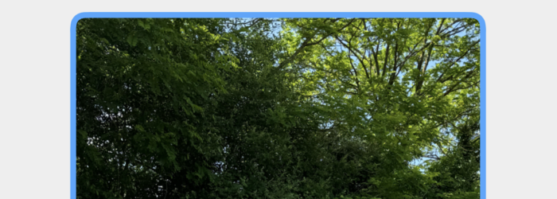
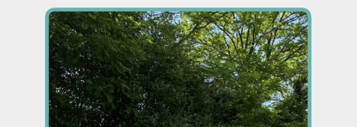
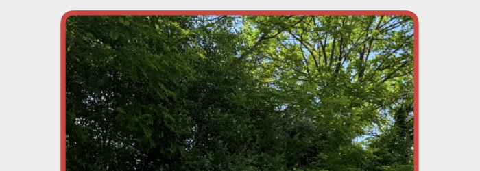
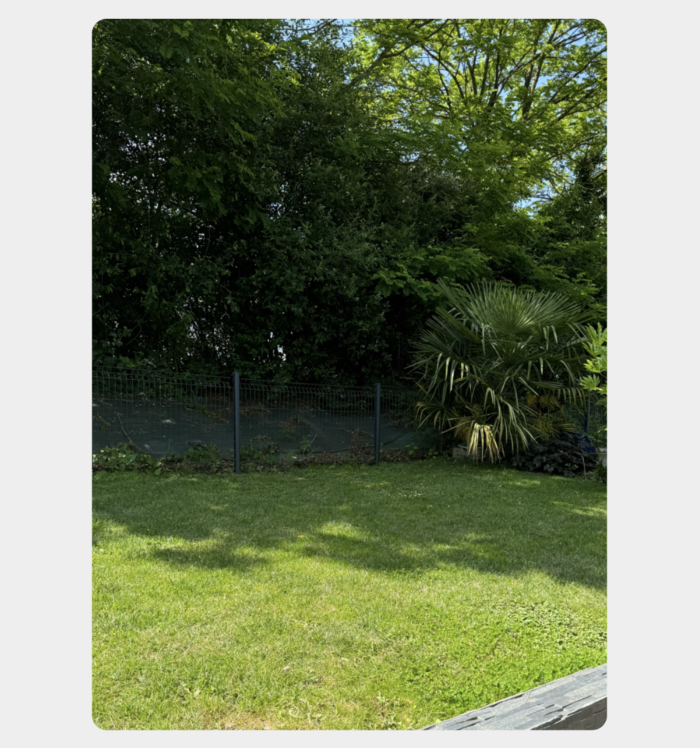
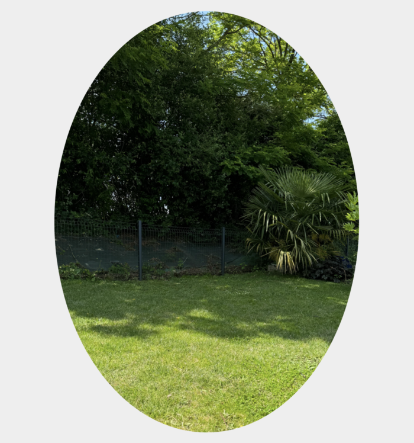
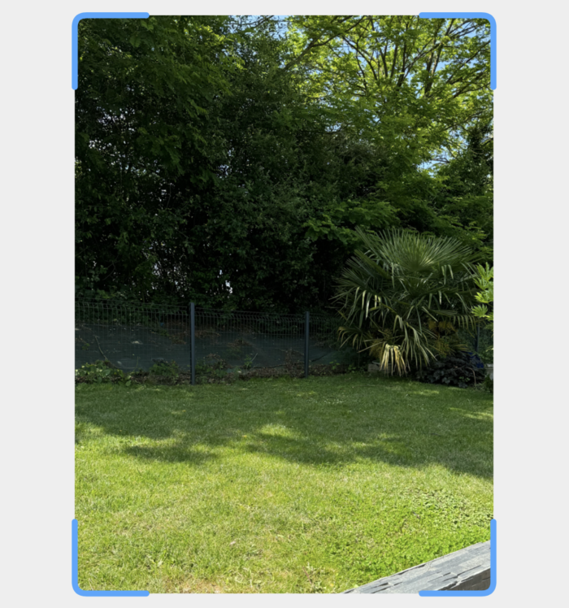
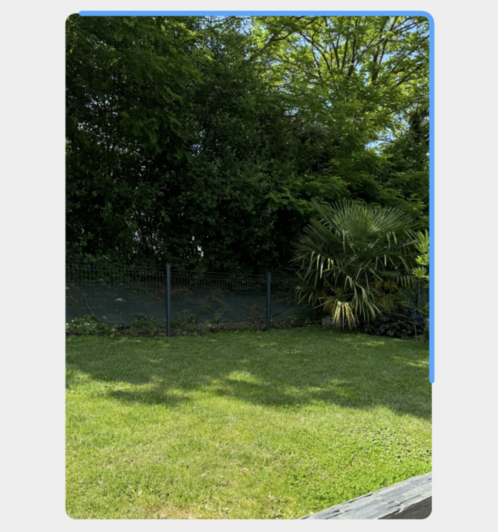
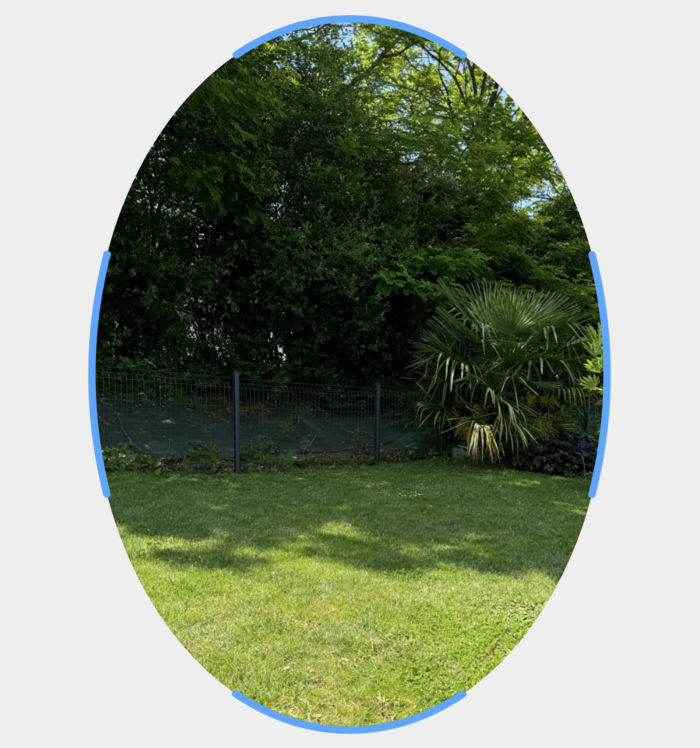
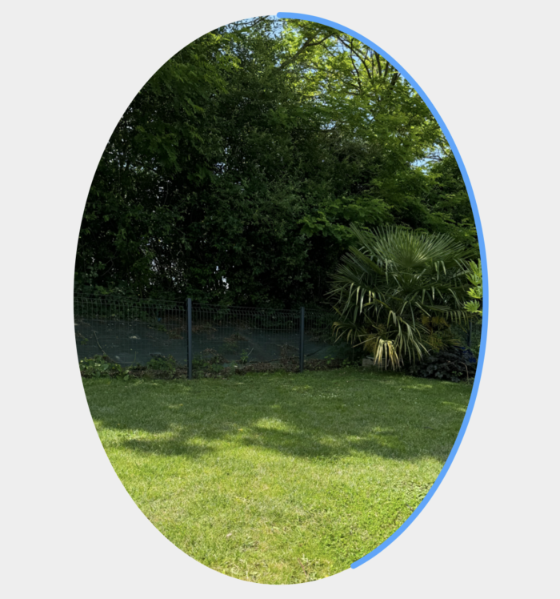

# IDnowMaskView

`IDnowMaskView` is a View that shows a mask above the entire screen. It has a plain background color and a clear fill color. The shape can be customizable according to several parameters which update the shape, the inner frame (based on a quad object), the outer color or the animation around the shape.
Notes:
- Only one specific property is accessible: `status`
- To fully update the view, `configure` function needs to be called using `IDnowMaskConfiguration`'s object

## Usage
### Configuration
```
myMaskView.configure(IDnowMaskConfiguration(
    quad: IDnowQuad.defaultQuad,
    shape: IDnowMaskShape.rectangle,
    overlay: IDnowMaskOverlay.none,
    status: IDnowMaskStatus.active
))
```

## Public Properties
| Variable name | Type | Visual rendering | Description |
| --- | --- | --- | --- |
| status | IDnowMaskStatus | Active <br>{width=200}<br> Processing <br> {width=200}<br> Success <br> {width=200}<br> Error <br> {width=200}<br>| Current mask's status. 4 possible values : <br>- `active` *(default value)*<br>- `processing`<br>- `success`<br>- `error` |


## Configuration
To configure the `IDnowMaskView`, it is possible either to set the variables as described above, or to use the [configuration protocol](./View%20Configuration.md). In our case, the object is named `IDnowMaskConfiguration`

| Name | Type   | Visual rendering | Description |
| --- | --- |--- |--- |
| quad | IDnowQuad | - | A quad object containing 4 CGPoints. It describes the frame of the shape. 4 parameters in it : <br>- `topLeft`<br>- `topRight`<br>- `bottomRight`<br>- `bottomLeft` |
| shape | IDnowMaskShape | <br> Rectangle <br> {width=200}<br> Oval <br> {width=200} | The shape of the mask to apply. 4 possible values : <br>- `rectangle` *(default value)*<br>- `oval` |
| overlay | IDnowMaskOverlay | <br> **Rectangle** <br> full <br> {width=200}<br> corners <br>{width=200} <br>progress <br>{width=200} <br> **Oval** <br> full <br> {width=200}<br> corners <br> {width=200}<br> progress <br> {width=200}          | The overlay of the mask to apply. 4 possible values: <br>- `none` *(default value)*<br>- `full` equivalent to a plain stroke<br>- `corners(isBouncing: Bool)` isBouncing can be set at true to animate the corner with a bouncing animation<br>- `.progress(duration: TimeInterval)`. Linear progress animation with duration's parameter which corresponds to the totale duration of the animation<br> |
| status | IDnowMaskStatus | See rendering in **Public Properties** section | Current status to apply above the mask. 4 possible values : <br>- `active` *(default value)*<br>- `processing`<br>- `success`<br>- `error`<br> |

## Usage
In order to use `IDnowMaskView`, you can simply call this view on your xib or storyboard.
