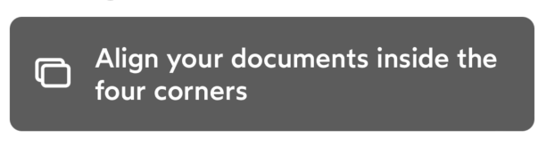

# IDnowMessageView

`IDnowMessageView`is a simple semi-transparent view with an optional left icon. Designed to display a message on top of the camera feed.

## Usage
### Configuration
```
myMessageView.configure(IDnowMessageViewConfiguration(
    text: "My message",
    icon: IDnowIcon.sun.image
))
```
### Methods
Display or hide messageView with animation
```
myInfoView.setHidden(true)
```
## Properties

| Variable name | Type | Visual rendering | Description |
| --- | --- | --- | --- |
| text | String? | {width=200} | Message text |
| iconName | String? | {width=200} | Name of the icon to display on the left of the text |

## Functions

### Configuration

| Variable name | Type | Description |
| --- | --- | --- |
| text | String? | Message text |
| icon | IDnowIcon? | Icon to display on the left of the text |


