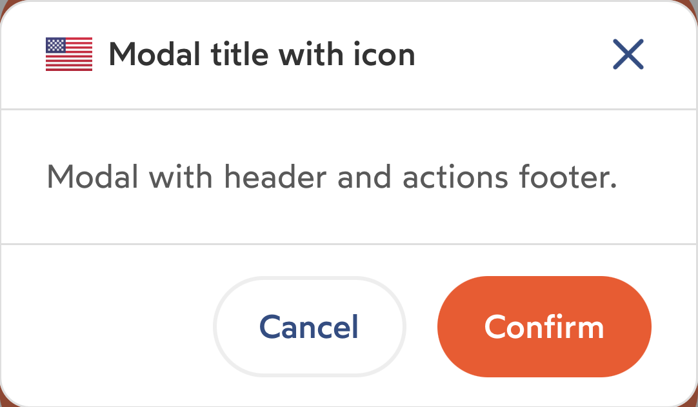
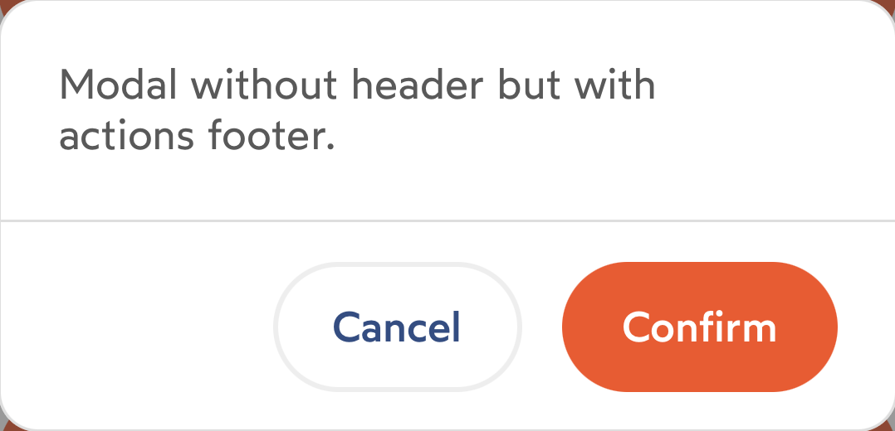
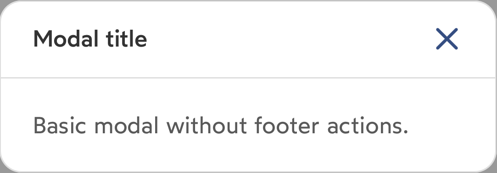
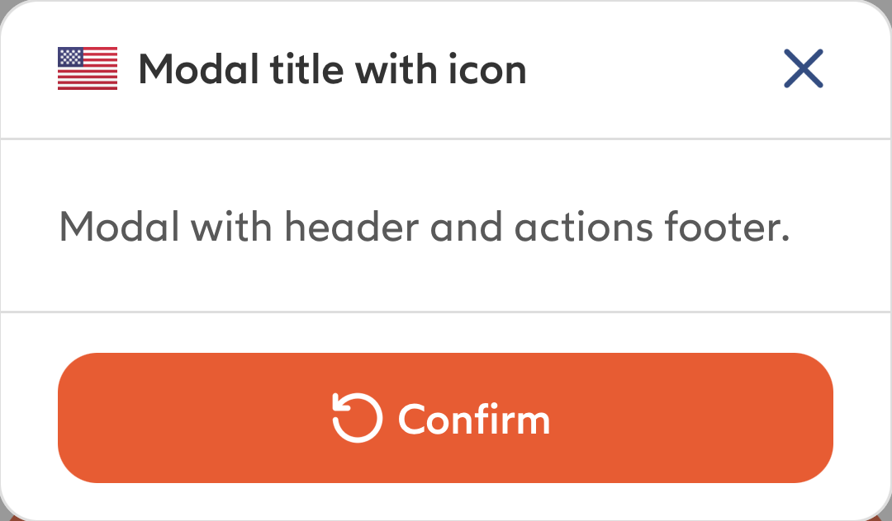

# IDnowModal

`IDnowModal` is a view controller that shows a modal. The modal contains: <br>- An optional header, containing an optional image, a text and a close button.<br>- An optional content, containing a custom view.<br>- An optional footer, containing two buttons.

## Usage
### Configuration
```
let myModalConfiguration = IDnowModalConfiguration(
    title: "My modal title",
    image: UIImage(named: "myImage"),
    isCloseButtonHidden:  false,
    closeButtonTouchUpInside: {
        // Action on close button tap
    },
    isHeaderHidden: false,
    content: myContentView,
    isFooterHidden: false,
    leftButtonTitle: "Left button",
    rightButtonTitle: "Right button",
    leftButtonIcon: IDnowIcon.cross.image,
    rightButtonIcon: IDnowIcon.check.image,
    leftButtonTouchUpInside: {
        // Action on left button tap
    },
    rightButtonTouchUpInside: {
        // Action on right button tap
    },
    rightButtonFillsContainer: false
)
```
### Methods
In order to use an IDnowModal, just call `showIDnowModal(configuration: IDnowModalConfiguration)` on a UIViewController instance.
```
myViewController.showIDnowModal(configuration: myModalConfiguration)
```
To hide the current modal displayed call `hideIDnowModal()`
```
myViewController.hideIDnowModal {
    // Action after hide current modal displayed
}
```

## Properties
| Variable name | Type | Visual rendering | Description |
| --- | --- | --- | --- |
| title | String? | - | Modal title |
| image | UIImage? | - | Add an image to the left of the title |
| isCloseButtonHidden | Bool | - | Possible values :<br>**- false** *(default value)* <br>**- true**<br><br>If true, hides the close button |
| closeButtonTouchUpInside | (() -> Void)? | - | Closure called when the user touches the close button of the header |
| isHeaderHidden | Bool | {width=200}<br>{width=200} | Possible values :<br>**- false** *(default value)* <br>**- true**<br><br>If true, hides the header |
| content | UIView? | - | UIView that will be put between the header and the footer of the modal |
| isFooterHidden | Bool | {width=200}<br>{width=200} | Possible values :<br>**- false** *(default value)* <br>**- true**<br><br>If true, hides the footer |
| leftButtonTitle | String? | - | Footer's left button title<br><br>If nil, the button will be hidden |
| rightButtonTitle | String? | - | Footer's right button title<br><br>If nil, the button will be hidden |
| leftButtonIcon | UIImage? | - | Left button's icon. Will be put on the left of the title. |
| rightButtonIcon | UIImage? | - | Right button's icon. Will be put on the left of the title. |
| leftButtonTouchUpInside | (() -> Void)? | - | Closure called when the user touches the footer's left button |
| rightButtonTouchUpInside | (() -> Void)? | - | Closure called when the user touches the footer's right button |
| rightButtonFillsContainer | Bool | {width=200} | Possible values :<br>**- false** *(default value)* <br>**- true**<br><br>If true, makes the right button fills its container. This will work only if the left button is hidden |

## Functions

### Configuration
To configure the IDnowModal, it is possible either to set the variables in the code one by one, or to use the [configuration protocol](./View%20Configuration.md).

| Name | Type | Description |
| --- | --- |--- |
| title | String? | Optional title of the modal |
| image | UIImage? | Optional image to put at the left of the title |
| isCloseButtonHidden | Bool | If true, hides the close button |
| closeButtonTouchUpInside | (() -> Void)? | Closure called when the user touches the close button of the header |
| isHeaderHidden | Bool | If true, hides the header |
| content | UIView? | UIView that will be put between the header and the footer of the modal |
| isFooterHidden | Bool | If true, hides the footer |
| leftButtonTitle | String? | Footer's left button title |
| rightButtonTitle | String? | Footer's right button title |
| leftButtonIcon | UIImage? | Left button's icon. Will be put on the left of the title. |
| rightButtonIcon | UIImage? | Right button's icon. Will be put on the left of the title. |
| leftButtonTouchUpInside | (() -> Void)? | Closure called when the user touches the footer's left button of the header |
| rightButtonTouchUpInside | (() -> Void)? | Closure called when the user touches the footer's right button of the header |
| rightButtonFillsContainer | Bool | If true, makes the right button fills its container. |

