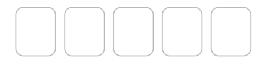
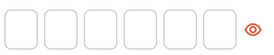

# IDnowPinView

`IDnowPinView` is an UI component for the pin-code data input. Appearance parameters are identical to [IDnowTextFieldView](./IDnowTextFieldView.md)

## Usage
### Configuration
```
myPinView.configure(IDnowPinViewConfiguration(
    digitsCount: 5,
    actionButtonVisible: true,
    errorText: "An error occured",
    disabled: false,
    processing: false
))
```

### Methods
Retrieve pin code
```
let currentCode = myPinView.getCode()
```
Set value
```
myPinView.setCode("1234")
```
Textfield delegate method
```
myPinView.didBeginEditing = {
    // Action on start editing myPinView
}
```
```
myPinView.didEndEditing = { myPinView in
    // Action on end editing myPinView
}
```

## Properties

| Variable name | Type | Visual rendering | Description |
| --- | --- | --- | --- |
| digitsCount | Int  | {width=200} | Sets the number of digits in the pin. Default value:*5* |
| actionButtonVisible | Bool | {width=200}<br />{width=200} | Toggles the right button visibility. Default value:*true* |
| pinInputFirstAccessibilityLabel | String |  | First part of the accessibility label of the input field. Describes the type of the field. Default value is "Code."


## Functions

### Configuration

Same as properties.

### Usage

Imitates the regular UITextField. Has the following callbacks:

```
public var didBeginEditing: (() -> Void)?
public var didEndEditing: ((IDnowPinView) -> Void)?
```

Action button has only one action: toggling the input visibility between the secure entry and regular digits.
