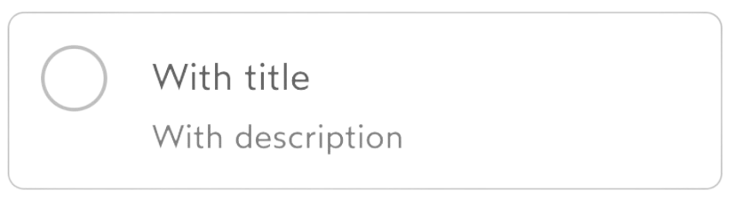
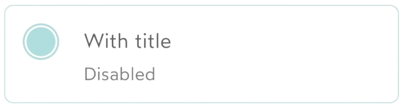
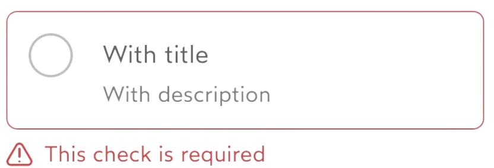
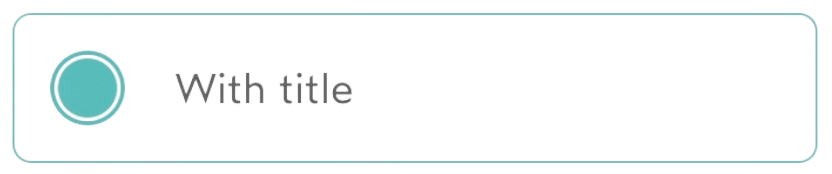

# IDnowRadio

Add a UIView type object to your storyboard and apply the `IDnowRadio` class to it.

## Usage
### Configuration
```
myRadio.configure(IDnowControlConfiguration(
    titleText: "My title",
    descriptionText: "My optional description",
    hasBorder: false,
    hasSeparator: false,
    isEnabled: true,
    errorText: "Error",
    controlSize: ControlSize.medium
))
myRadio.actionDelegate = self
```

### Methods
```
extension MyViewController: IDnowControlsActionsDelegate {
    func onChangeState(sender: IDnowBaseControl, state: ControlState) {
        if sender == myRadio {
            // Do action on state change for my control
        }
    }

    func onTitleLinkTap(sender: IDnowBaseControl, link: URL) {
        if sender == myRadio {
            // Do action on title link tap for my control
        }
    }

    func onDescriptionLinkTap(sender: IDnowBaseControl, link: URL) {
        if sender == myRadio {
            // Do action on description link tap for my control
        }
    }
}
```

## Properties

| Variable name | Type | Visual rendering | Description |
| --- | --- | --- | --- |
| titleText | String? | {width=100} | Control title. |
| descriptionText | String? | {width=300} | Control description. |
| hasBorder | Bool? | {width=300} | Possible values :<br> - **true** <br>- **false** *(default value)* <br><br> Add a border around the control. |
| hasSeparator | Bool? | {width=300} | Possible values :<br> - **false** *(default value)* <br>- **true** <br><br> Add a separator under the control. |
| controlSize | ControlSize? | - | Possible values :<br> - **sm** <br>- **md** *(default value)* <br>- **lg** <br><br> Set control size. |
| isEnabled | Bool? | {width=300} | Possible values :<br> - **false** *(default value)* <br>- **true** <br><br> Makes the button active or not. |
| errorText | String? |  {width=300} <br> {width=300} | Add error text under control. |
| controlState | ControlState | {width=300} <br> {width=300} | Possible values (*ControlState*) : <br> - **checked** <br>- **unchecked** *(default value)* <br>- **intermediate** <br><br> Set control state. |
| **Margins** | - | - | - |
| marginTop<br> marginBottom <br> marginLeft <br> marginRight | String | - | Possible values (*IDnowSpacingToken*) : <br> - **noSpacing** *(default value)* <br>- **secondary** <br>- **spacingXs** <br>- **spacingSm** <br>- **spacingMd** <br>- **spacingLg** <br>- **spacingXl** <br>- **spacing2xl** <br>- **spacing3xl** <br><br> In order to add margins around the component, you can use IDnowSpacingToken to keep your application consistent (set all constraints to 0 in the storyboard). |

## Functions
### Delegate

When using an IDnowRadio, you must implement the delegate by setting the variable **actionDelegate** (IDnowControlsActionsDelegate). This delegate allows you to have all the actions of a control.

- **onChangeState(state: ControlState)** : Triggered when the control changes state
- **onTitleLinkTap(link: URL)** : Triggered when a URL in the element's title is pressed 
- **onDescriptionLinkTap(link: URL)** : Triggered when a URL in the element's description is pressed 

### Configuration


| Name | Type | Description |
| --- | --- | --- |
| titleText | String? | Title of the control. |
| descriptionText | String? | Description text for the control. |
| hasBorder | Bool | Toggles the border visibility of the control. |
| hasSeparator | Bool | Toggles the bottom separator visibility of the control. |
| isEnabled | Bool | Toggles the control state. |
| errorText | String? | Specifies the thext for the error that is deisplayed below the control. |
| controlSize | String | Specifies the size of the control element. String representation of```ControlSize```. |
