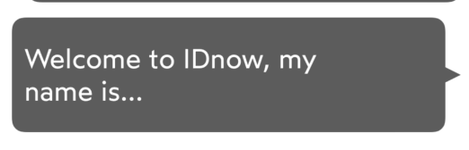

# IDnowSpeechBubbleView

`IDnowSpeechBubbleView` is a simple UILabel subclass that emulates an appearance of a speech bubble with a triangle that is displayed on either left or right side of the view.

## Usage
### Configuration
```
```

## Properties

| Variable name | Type | Visual rendering | Description |
| --- | --- | --- | --- |
| speechDirection | SpeechBubbleDirection | {width=180}<br />{width=180} | Possible values :<br> - **left** *(default value)* <br>- **right** |

