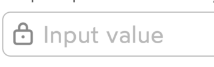
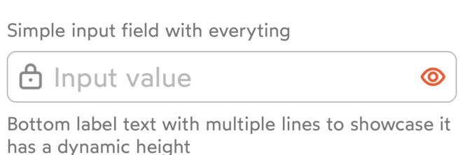
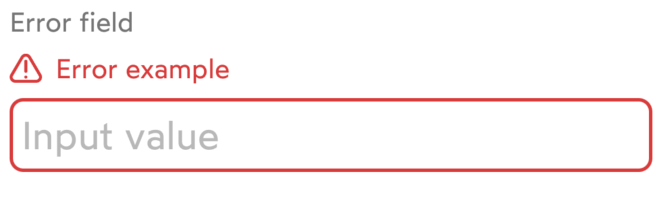
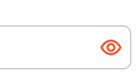
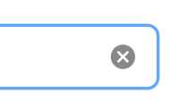
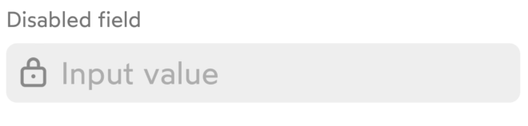
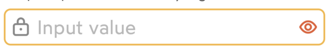

# IDnowTextFieldView

`IDnowTextFieldView` is an UI component designed to handle the user input and represent it as a single line of text. <br/>
All the text input elemets (TextViews and TextFields) conform to the [IDnowTextInput](https://gitlab.rennes.ariadnext.com/mobile/idnow-design-system/design-system-ios/-/blob/develop/Sunflower/Sunflower/SunflowerUIKit/Components/IDnowTextInput/Common/IDnowTextInput.swift) protocol and inherit from the [IDnowBaseTextInputView](Sunflower/Sunflower/SunflowerUIKit/Components/IDnowTextInput/Common/IDnowBaseTextInputView.swift). This protocol describes the common properties and methods of all text input views.

## Usage
### Configuration
```
myTextField.configure(IDnowTextFieldConfiguration(
    placeholderText: "My placeholder",
    topText: "My textfield name",
    bottomText: "My textfield description",
    errorText: nil,
    leftIcon: IDnowIcon.lock.image,
    rightIcon: IDnowIcon.eyeOn.image,
    clearButtonVisible: false,
    disabled: false,
    processing: false
))
```
```
myTextField.rightButtonPressed = {
    // My action on right button tap
}
```

### Methods
```
myTextField.setRightIcon(IDnowIcon.eyeOn.image)
```
```
myTextField.setLeftIcon(IDnowIcon.lock.image)
```
```
let hasRightAction = myTextField.hasRightAction()
```
```
let hasLeftView = myTextField.hasLeftView()
```

## Properties

Input fields are configured by the ```IDnowTextFieldConfiguration``` that contains the following:

| Variable name | Type | Visual rendering | Description |
| --- | --- | --- | --- |
| placeholderText    | String?  | {width=100} | Optional text to be displayed as the field's hint. |
| topText | String?  | {width=200} | Optional text to be displayed above the input field. |
| bottomText | String?  | {width=200} | Optional text to be displayed below the input field. Note: not supported for the dropdown elements. |
| errorText | String? | {width=200} | Optional error text to be shown at the top of the input field that makes the entire field to enter the error state. |
| leftIcon | UIImage? | {width=100} | Optional icon to display before the input field content. |
| rightIcon | UIImage? | {width=100} | Optional icon to display after the input field content (acts as a button) |
| clearButtonVisible | Bool | {width=100} | Toggles the visibility of the clear button on the right of the input field. Default:*false* |
| disabled | Bool | {width=200} | Toggles the disabled state and appearance. Default:*false* |
| processing | Bool | {width=200} | Toggles the processing/loading state. Default:*false* |
| rightActionButtonAccessibilityLabel | String | |Setups the accessibility label on the right action Button.