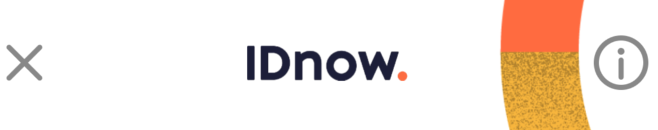
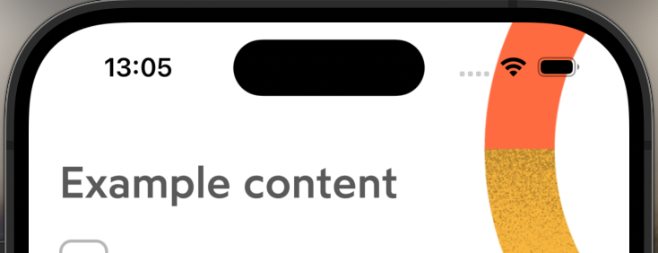
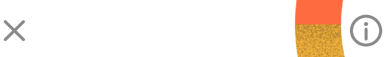
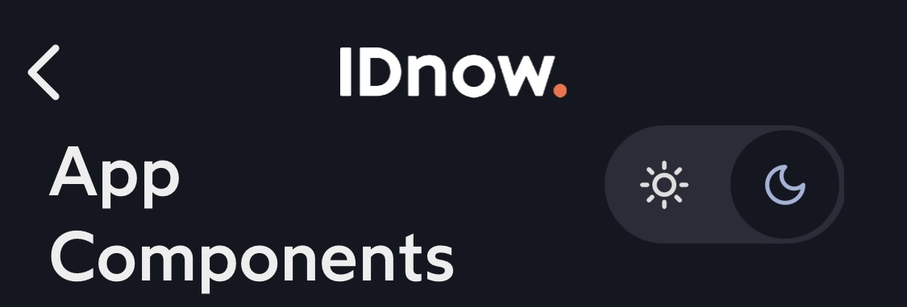
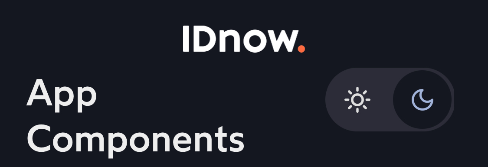

# IDnowViewController

Base view controller to display the screen content that has configurable header view with navigation buttons and a logo at the bottom.

## Usage
### Configuration
```
let myCurrentViewController = UIViewController()
let myHeaderConfiguration = IDnowScreenHeaderConfiguration(
    leftIcon: IDnowIcon.cross.image,
    primaryIcon: IDnowIcon.info.image,
    secondaryIcon: nil,
    primaryIconTintColor: IDnowColorsToken.Graphic.main.color,
    secondaryIconTintColor: IDnowColorsToken.Graphic.main.color,
    leftButtonAccessibilityLabel: "Close",
    primaryAccessibilityLabel: "Information",
    secondaryAccessibilityLabel: nil,
    brandLogoVisible: true,
    leftButtonVisible: true,
    isRecordingViewVisible: false
)

myIDnowViewController.configure(IDnowViewControllerConfiguration(
    contentViewController: myCurrentViewController,
    headerVisible: true,
    poweredLogoVisible: true,
    backgroundImage: nil,
    headerConfig: myHeaderConfiguration
))
```
```
myIDnowViewController.leftActionPressed = {
    // Action on tap left button
}
```

```
myIDnowViewController.primaryActionPressed = {
    // Action on tap primary button
}
```
```
myIDnowViewController.secondaryActionPressed = {
    // Action on tap secondary button
}
```

## Properties
| Variable name | Type              | Visual rendering  | Description                                                                                         |
| --- |-------------------| --- |-----------------------------------------------------------------------------------------------------|
| poweredLogoVisible | Bool              | {width=200} | Toggles visibility of the logo icon at the bottom of the screen.<br />Default: *true*               |
| headerVisible | Bool              | {width=200}<br />{width=200}| Toggles visibility of the top header view with the close button and other elements. Default: *true* |
| headerBrandLogoVisible | Bool              | {width=200}<br />{width=200} | Toggles the visibility of the brand logo icon at the center of the header. Default:*true*           |
| headerLeftButtonVisible | Bool              | {width=200}<br />{width=200} | Toggles the visibility of the button at the left of the header. Default:*true*                      |
| backButtonIcon | UIImage?          | - | Optional custom icon to use as a back button. X by default.                                         |
| leftActionPressed | (() -> Void)?     | - | Callback when left action button is pressed                                                         |
| primaryActionPressed | (() -> Void)?     | - | Callback when the primary action button is pressed                                                  |
| secondaryActionPressed  | (() -> Void)?     | - | Callback when the secondary action button is pressed                                                |
| contentViewController  | UIViewController? | - | A view controller to be displayed as the content of the current screen.                             |
| backButtonIcon | UIImage?          | - | Optional icon for the left action button                                                            |
| primaryButtonIcon | UIImage?          | - | Optional icon for the primary action button on the right                                            |
| secondaryButtonIcon | UIImage?          | - | Optional icon for the seccondary action button on the right                                         |
| isRecordingViewVisible | Bool              | - | Toggles visibility of the recording view at the right of the screen.<br />Default: *false*          |
| leftHeaderButton | UIButton?         | - | The button located on the left of the header. It is an optional, get-only property.                 |
| rightHeaderPrimaryButton | UIButton?         | - | The button located on the right of the header. It is an optional, get-only property.                |
## Functions

### Configuration
To configure the IDnowViewController, it is possible either to set the variables in the code one by one, or to use the [configuration protocol](./View%20Configuration.md).

#### IDnowViewControllerConfiguration

| Name | Type | Description |
| --- | --- |--- |
| contentViewController | UIViewController? | A view controller to be displayed as the content of the current screen. |
| headerVisible | Bool | Property which toggles visibility of the top header view with the close button and other elements. Default: *true* |
| poweredLogoVisible | Bool | Property which toggles visibility of the logo icon at the bottom of the screen.<br />Default: *true* |
| backgroundImage | UIImage? | Optional image to use as the background for the entire screen. |
| headerConfig | IDnowScreenHeaderConfiguration | Object which contains properties to update the header |

#### IDnowScreenHeaderConfiguration
Here is the `headerConfig` object available in IDnowViewControllerConfiguration which is used to configure the IDnowScreenHeaderView.

| Name | Type | Description |
| --- | --- | --- |
| leftIcon | UIImage? | The icon to set on left button. |
| primaryIcon | UIImage? | The icon to set on right primary button. |
| secondaryIcon | UIImage? | The icon to set on right secondary button. |
| primaryIconTintColor | UIColor  | Color of the primary icon.<br />Default: *IDnowColorsToken.Graphic.main.color* |
| secondaryIconTintColor | UIColor  | Color of the secondary icon.<br />Default: *IDnowColorsToken.Graphic.main.color* |
| leftButtonAccessibilityLabel | String | Specific label for left button. |
| primaryAccessibilityLabel | String | Specific label for right primary button. |
| secondaryAccessibilityLabel  | String | Specific label for right secondary button. |
| brandLogoVisible | Bool     | Property which toggles visibility of the brand logo.  |
| leftButtonVisible | Bool     | Property which toggles visibility of the left button. |
| isRecordingViewVisible | Bool.    | Property which toggles visibility of the recording view. |